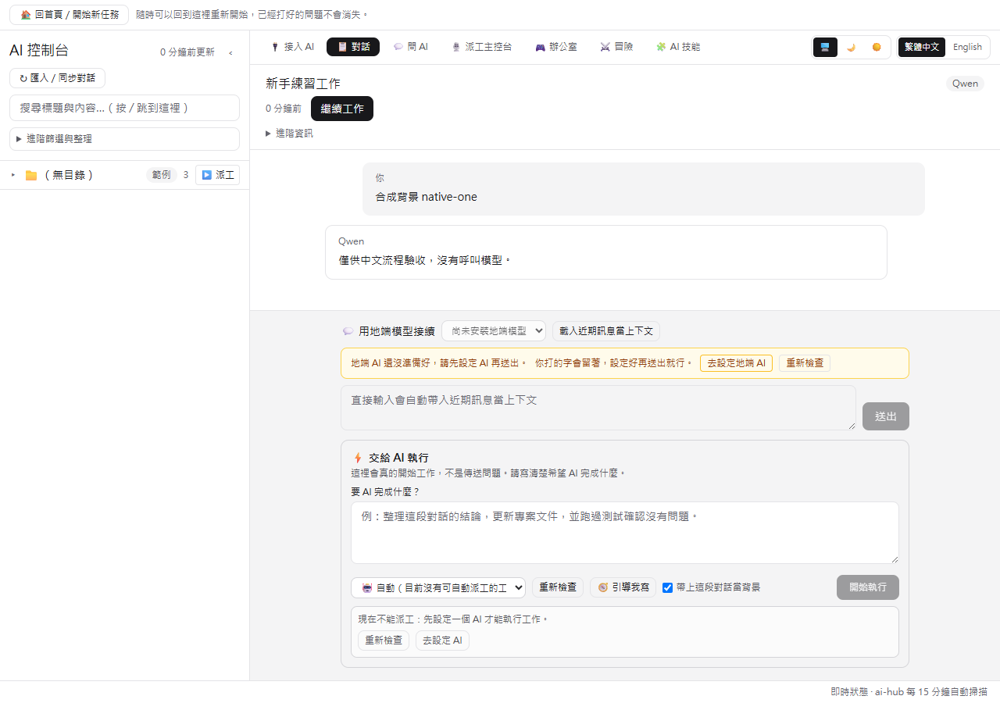
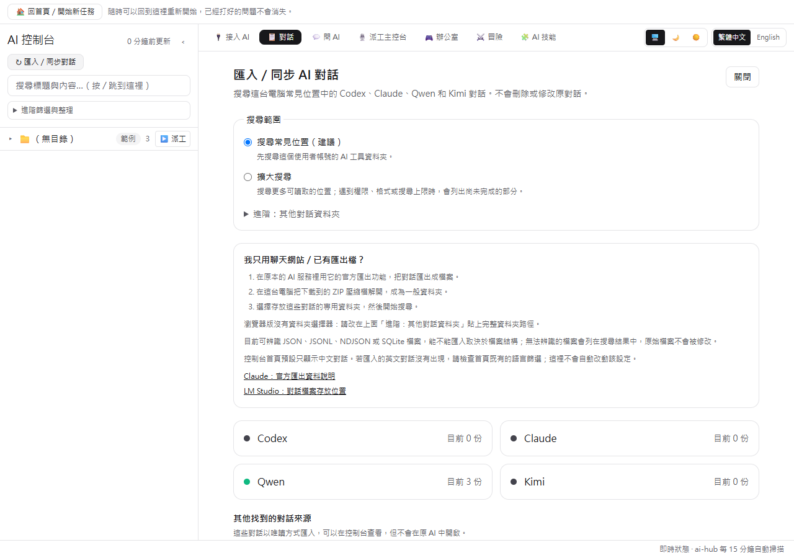
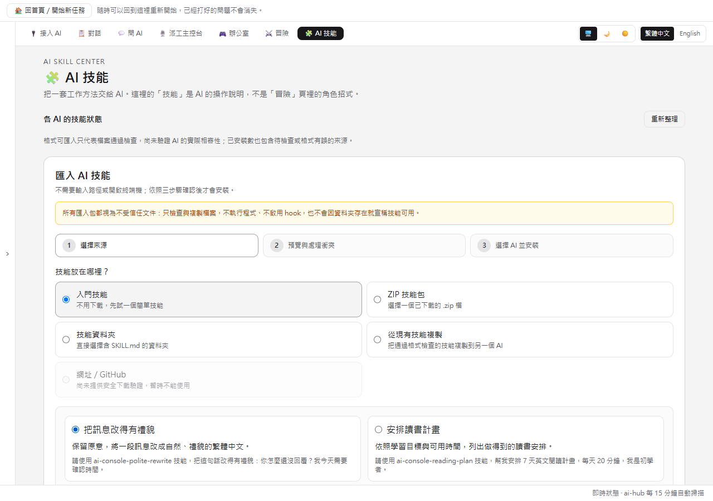
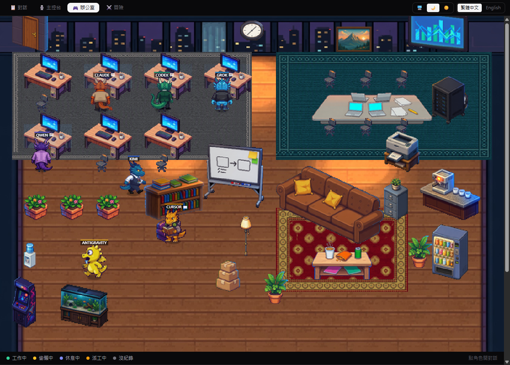
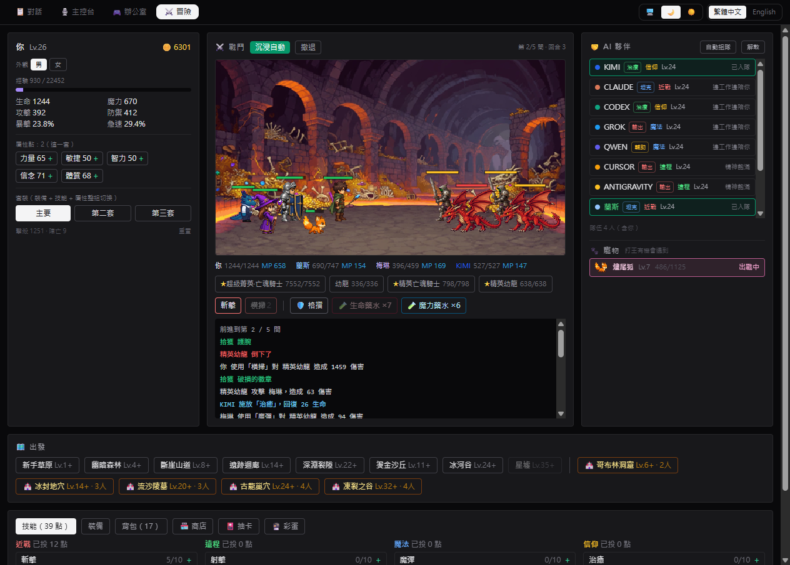
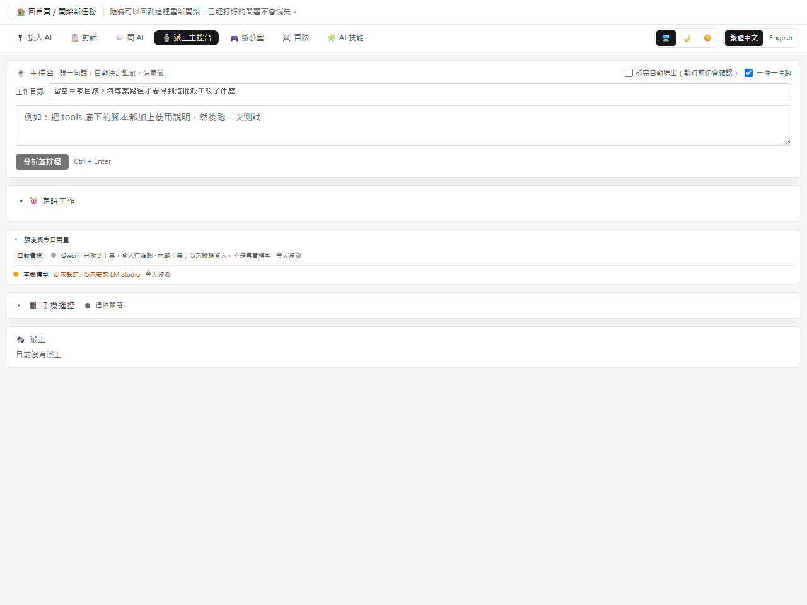

<p align="center">
  
</p>

# AI 控制台 · AI Console

給一般使用者與第一次接觸 AI 的人使用的本地控制台：用白話入口找舊對話、同步四個 AI、直接問地端模型、管理技能，或把工作明確派給 AI 執行。
附一間會動的像素辦公室，和一套可以邊工作邊玩的小型 MMORPG。

**索引、搜尋、技能預覽與控制介面都在本機執行。**「直接問 AI」只連本機 LM Studio；只有使用者明確派工給雲端 AI CLI 時，內容才會依該工具的服務方式送出。介面支援繁體中文與 English。

> A local hub for every AI CLI on your machine — one searchable inbox for all your
> conversations, one-click resume in the original working directory, and a local-model
> chat that continues any thread without burning cloud quota. Ships with a pixel office
> that visualises each tool as a dragon, and a small single-player MMORPG to idle in.
> The index, search, skill preview, and control UI run on `127.0.0.1`. “Ask AI” uses
> local LM Studio only; content reaches a cloud provider only when you explicitly dispatch
> work to that provider's CLI.
> The UI is available in Traditional Chinese and English.













## 功能

- **新手首頁**：第一畫面只問「你現在想做什麼？」並提供「找回舊對話／直接問 AI／交給 AI 執行／管理 AI 技能」四個入口；同步按鈕就在搜尋旁，不要求先懂模型名、CLI 或資料夾路徑
- **問問題與執行工作完全分開**：「💬 問 AI」只回答、不動檔案、不呼叫工具；「🎙️ 派工主控台」才會真的開始工作，送出前還會再次明說可能讀寫專案檔案
- **四工具對話同步**：Codex、Claude、Qwen、Kimi 一次掃描，每個來源分別顯示找到幾份、失敗原因與可行修復；停止按鈕會誠實說明只是停止畫面等待，後端可能仍在完成
- **AI 技能中心**：列出每個 AI 已安裝與相容技能，透過 ZIP、資料夾或既有技能進行三步驟匯入。匯入包一律視為不受信任資料，只檢查與複製，不執行腳本或 hook，不覆寫同名技能；全域治理技能只能作為唯讀來源，不能由新手精靈寫入
- **統一對話索引**：**掃描全機找出所有 AI 工具的對話紀錄**。判斷依據是檔案內容
  （JSONL 每行是不是帶 role 的訊息、SQLite 有沒有 thread/session/message 表），
  不是寫死的工具名單 —— 所以你裝的工具沒被寫進程式，一樣掃得到
- **還原原生名稱**：對話標題直接讀取各工具的官方紀錄（Codex threads DB、Grok summary.json、Kimi state.json…）
- **搜對話內容，不是只搜標題**：標題是各家工具自己取的，常常跟內容沒關係 ——
  但人記得的是「我那時候在哪一段對話裡討論過 CP950」。
  側欄搜尋同時比對標題與**全部訊息內容**，命中的片段直接列出來（含前後文與說話者），
  點一下就打開那份對話。實測搜「CP950」標題 0 筆、內容 3 份。
  純掃描不建索引：646 份 12 MB 掃一次約 55 ms，建索引省下的時間還不夠付它會過期的代價
- **鍵盤操作**：`/` 跳到搜尋、`Esc` 清掉、`Ctrl+1~6` 切分頁、`Ctrl+B` 收合側欄。
  在輸入框裡打字時不會搶走按鍵
- **專案資料夾分組**：保留各工具原本的工作目錄結構，ChatGPT 式側欄
- **去重**：同一 session UUID 出現多份（跨工具副本 / resume 鏈）自動收攏，保留最新正本
- **時間收納**：一週未用的對話預設收起，保持清單清爽
- **控制 API**（僅 127.0.0.1）：
  - `▶ 派工 / 接續` — 一鍵在原本目錄開終端接續對話（claude --resume / codex resume / kimi -r）
  - `↻ 重新掃描` — 即時重建索引
- **主控台派工**：一個輸入框說一句話，系統自動拆成多張工單、決定每張交給哪個 AI CLI，
  再一次派出去。每張工單都會自動掛上這台機器的規範檔路徑與技能目錄，
  要求執行者先讀規範、自己比對 frontmatter 啟用該用的技能，不會裸奔執行。
  - **你指名誰就是誰**：句子裡寫「用 codex…」「叫 qwen…」會直接照做，優先於自動判斷；
    agy／Gemini（ANTIGRAVITY）也能無頭派工，而且因為走獨立額度池，撞額度自動接力時第一個試它；
    Claude／Codex 是派工平台，排在接力鏈最後
  - **一件一件跑**：佇列在伺服器端，前一件的行程真的結束才派下一件 ——
    多個 agent 同時改同一批檔案會互相蓋掉。切到別的分頁或關掉畫面都不影響
  - **看得出有沒有在動**：每一件顯示最後一行輸出與已跑多久，不是只有一個「執行中」
  - **💬 補一句**：工作跑歪了可以中途補指令。無頭執行沒有 stdin 可以插話，
    所以是用各家的續談旗標再派一次；上一輪還在跑就先排隊，結束後自動送出
  - **📝 看改了什麼**：派工結束後直接在畫面上看它動了哪些檔案、逐檔展開 patch。
    指定工作目錄就能用（留空＝家目錄，那裡不是 git 專案所以看不到東西）
  - **成敗與花費看得出來**：exit code 不能當作成功。實際踩過的案例是
    agent 撞上 API 529、一個檔都沒改就結束，而行程回傳 0 ——
    畫面顯示「已完成」，幾小時後才有人發現。現在會分成
    「已完成／跑完了但沒有改到任何檔案／依規範停下／執行失敗（附原因）」，
    並顯示這一趟的美金與 token 數。
    判定會掃**完整** log 而不是尾端：那份 529 的失敗標記落在 1.1 MB 檔案的
    42%～53% 處，只看最後 64 KiB 永遠抓不到 —— 這個功能一度在它自己的
    起因案例上是壞的。掃描依 log 大小增量進行，已結束的派工一輩子只掃一次
  - **「依規範停下」不算失敗**：agent 回報 BLOCKED 是照規範做對了。
    跟 529、崩潰混在同一個紅色裡的話，使用者會學會忽略紅字，
    然後真正的失敗也一起被忽略
  - **↻ 重派**：失敗或沒改到檔的那幾件可以用同一份工單、同一個工具再派一次。
    529 是伺服器端的暫時性問題，不該讓人把幾十行的工單重打一遍。
    重派產生新紀錄而不是覆蓋舊的 —— 重試過幾次、每次結果是什麼，本身就是資訊
  - **↪ 撞額度自動換人**：某個工具回「額度用完」（週額度、429、insufficient_quota），
    或 cursor 開了終端十分鐘沒人按 Enter，後端自動把同一份工單（含前一個做到哪裡）
    接力給下一個能無頭跑、沒限流的工具，最多兩手。順序是省錢順序：
    agy → qwen → kimi → grok → codex → claude。只在額度原因時換 ——
    程式錯誤換誰都一樣壞，BLOCKED 是規範擋的
  - **⏹ 停止執行中的派工**：先確認再砍整棵行程樹，停了老實標成「已停止」（不會像用工作管理員殺掉那樣顯示成「已完成」）。agy 派工改走 JSON 模式，成本欄看得到它的 token 數，日誌仍顯示回覆原文。
  - **額度與今日用量**：派工面板最上面一條，列出每個工具還有沒有額度、什麼時候恢復、今天派了幾件、燒了多少 token；「自動」現在會挑到誰直接標出來。資料來自 `/api/dispatch/usage`。
  - **agy 在下拉裡、而且排第一**：工具清單照接力鏈的省錢順序（agy → qwen → kimi → grok → codex → claude），終端工具最後。以前「自動」會挑到 agy，下拉卻選不到它。
  - **拆解的預設執行者不再是 claude**：拆不出來、或整句交給一個人的時候，交給最便宜的可用工具；拆解提示也告訴地端模型各工具的價差。
  - **📱 手機遙控**：桌面版按「開啟遙控」，後端在 **Tailscale 網卡**上多開一個埠（5178；不開放區網與公網），畫一個 QR；手機掃了就自動配對，之後用手機瀏覽器（可加到主畫面當 App）看派工、派工、補一句、停止、取消、重派、看日誌。每個請求都要帶配對 token（十分鐘內猜錯十次就擋），只開放派工相關的路徑——對話、檔案、技能、設定一律不給。「換一把 token」或「關閉」之後舊手機立刻連不上。
  - **🔔 系統通知**：派工結束發一則作業系統通知，點擊把視窗叫回前面。
    這個程式的用法就是派出去之後切去做別的事，不然只能每隔幾分鐘切回來看一眼
- **⏰ 定時工作**：設定一次就自己跑。每隔 N 分鐘 / 每天 HH:MM / 每週某天 HH:MM。
  刻意不做 cron 語法（那是給工程師的），也刻意不補跑錯過的
  —— 電腦關一整夜，早上開機不該一次噴出八份報告
- **黑色 / 亮色 / 跟隨系統**：三種主題，選擇會記住
- **垃圾桶**：不是目前在用的工具、太久沒動、或在原本工具裡已封存的對話，
  預設收進垃圾桶。**檔案完全沒有動**，隨時看得回來，也可以單筆「留著」放回主清單
- **地端續聊**：選任何對話 → 用 LM Studio 地端模型（如 Qwen3.8-27B）帶著近期上下文直接繼續聊，不依賴雲端額度。若尚未連上模型，畫面會直接提示「開啟 LM Studio → 載入完整模型 → 啟動 Local Server」，並提供重新檢查按鈕
- **像素辦公室**：把每個 AI 工具具象化成一隻龍，在俯視像素辦公室裡走動、工作、開會，狀態一眼看得出來
- **冒險模式**：內建一套小型 MMORPG，可以邊工作邊掛機練功；純單機，clone 下來就能玩
- **ai-hub 整合**（選配）：讀取 `~/ai-hub/status.json` 顯示各工具即時限流/活動狀態與專案接力標記

## 掃描全機 AI

```bash
python tools/scan_ai.py          # 看掃到哪些 AI 對話來源
python tools/scan_ai.py --deep   # 放寬上限，掃得更徹底
python tools/indexer.py --rescan # 重新掃描並重建索引
```

掃描只讀不寫，有深度、檔案數、時間三重上限，不會翻整台硬碟。結果快取在
`public/data/sources.json`，七天內不重掃。掃不到的話可以用
`AI_CONSOLE_SCAN_DIRS` 指定額外目錄。

## 生圖與生影片

```bash
python tools/imagegen.py          # 看這台機器有哪些 AI 能產圖
python tools/kimi_media.py check  # 檢查 Kimi 憑證與端點
```

**Kimi 桌面版是憑證登入的**，不需要另外申請 API key —— `tools/kimi_media.py`
會從桌面版自己的設定檔讀出金鑰與正式端點，接上 image / video / speech：

```bash
python tools/kimi_media.py image --description "…" --output out.png
python tools/kimi_media.py video --description "…" --output out.mp4 --duration 5
```

金鑰只在記憶體裡傳給 SDK，不會印出來也不會寫進 log。

## 快速開始

需求：Node.js 20+、Python 3.10+（純標準庫，無 pip 依賴）

```bash
npm install                # 安裝前端依賴
python tools/indexer.py    # 建立對話索引 → public/data/
npm run build              # 建置前端 → dist/
python server/api.py       # 啟動整合伺服器 → http://127.0.0.1:5177/
```

開發模式（熱更新）：`npm run dev`（會同時啟動 API + vite）。

```bash
npm run verify             # 型別 + 靜態檢查 + 前後端測試，一次跑完
npm test                   # 前後端測試一起跑（698 個）
npm run test:web           # 只跑前端（vitest，248 個）
npm run test:py            # 只跑後端（unittest，354 個，純標準庫）
npm run typecheck          # 型別檢查（等同 tsc -b）
npm run lint               # 靜態檢查（零警告）
npm run pack               # 產生 Windows x64 可攜版到 release/
```

> **不要用 `npx tsc --noEmit`。** 根 `tsconfig.json` 是 `"files": []` 的
> references 容器，那道指令會掃 0 個檔案然後回傳 0 —— 看起來過了，其實什麼都沒檢查。
> 少一個 import 都抓不到，直到 `npm run build` 才炸。要嘛 `npm run typecheck`，
> 要嘛 `npx tsc --noEmit -p tsconfig.app.json`（指定專案）。

後端測試刻意用標準庫的 `unittest` 而不是 pytest —— Python 這一側沒有任何
pip 依賴，測試不該是第一個引進的。覆蓋的重點是「看程式碼看不出來、
要壓測才會現形」的那幾類：同一毫秒的 id 撞號、併發讀改寫掉資料、
排程 tick 期間別的執行緒拿不拿得到鎖、把使用者文字放進命令列會發生什麼事。

地端續聊：安裝 LM Studio 並啟動其本地伺服器（預設 `127.0.0.1:1234`），載入任一模型即可。

## 像素辦公室（🎮 分頁）

七個 AI 工具各自是一隻龍，住在一間程式繪製的俯視像素辦公室裡。畫面不是裝飾，
每個動作都直接對應真實狀態：

| 真實狀態 | 畫面行為 |
|---|---|
| `active` | 坐回自己桌前**瘋狂打電腦**（角色抖動、螢幕跑碼）；兩成機率走去找同事**辯論**（互冒 💢 與對白） |
| `idle` | 在辦公室**偷懶**：上廁所（人消失在門後）、看書、走來走去、泡咖啡、種花 |
| `rate_limited` | 走去沙發**躺下睡覺**，頭上對話框寫明**休息到幾點**（從派工 log 解析工具自己回報的恢復時間） |
| 有 alive 派工 | 走到白板前**執行任務**，白板亮起並跑進度條 |
| `unknown` | 灰階淡出 |
| 三人以上在工作 | 定期自動**開會**：全員走進玻璃會議室就座 |

點任何一隻龍即可開對話框，用地端模型跟它聊天。

## ⚔️ 冒險（小型 MMORPG）

「⚔️ 冒險」分頁設計成「邊工作邊玩又不無聊」。**純單機**，不需要任何雲端服務或帳號。

戰鬥是**回合制**（吞食天地／軒轅劍天之痕那種）：一回合裡你先下令要打誰、用哪招，
全場再依速度依序出手。不想動手時切成「沉浸自動」，它會自己打 ——
你切去派工、看對話的時候它照打，切回來隨時接手。

- **沒有職業**：近戰／遠程／魔法／信仰四條線共 16 個技能，各線投點到門檻才解鎖下一階
- **三組套裝**：裝備 + 技能配點 + 屬性配點各存一份，一鍵整組換（坦組／輸出組／補師組）。
  **每一套的配點額度各自獨立**，不共用同一個點數池
- **裝備**：8 個部位、6 種品質（粗製／普通／精良／稀有／傳說／神話）、隨機詞綴，
  附分數方便比較；一鍵擇優換裝、一鍵賣雜物。神話只有彩蛋拿得到，見下面
- **商店**：藥水、補給包、隨機裝備、精製保底、洗屬性點／技能點 —— 金幣有地方花
- **夥伴**：三種來源、四種定位。七隻 AI 龍是內建的，永遠揪得到；
  十一個人形夥伴要抽卡（傳說階四個定位都有 —— 只有輸出與輔助的話，
  玩坦或玩補的人抽到傳說等於沒抽到）；四個彩蛋夥伴要解鎖條件。
  **每個夥伴各自累積經驗、各自升級** —— 練誰不練誰是真的有差。
  地城人數不夠會自動補位，打到一半才入隊也會立刻出現在戰場上
- **隊伍人數上限自己設**：3～5 人（含主角），預設 4。
  人少每個夥伴的存在感強、回合跑得快；人多容錯高、畫面熱鬧 ——
  那是口味不是平衡問題，所以交給玩家。調小之後超出的人會自動請下場，
  地城的「建議人數」也不會覆蓋你設的上限
- **抽卡**：夥伴與裝備兩個池。**沒有課金** —— 券從打王與超級菁英掉，
  也可以用金幣換，所以它是金幣的另一個出口而不是付費牆。
  重複的夥伴會轉成那一隻的經驗，十連最後一抽保底稀有
- **強化（會爆裝）**：裝備可以 +1 到 +15。+6 以前失敗頂多退級，+7 起有機率直接碎掉；
  保護符可以擋碎裂。沒有失敗代價的強化只是按到夠有錢為止，不是選擇。
  三種結果三種手感：成功往上炸金色火花、退級震一下轉冷色、碎裝頓幀後碎片墜落。
  沒有這層回饋的話，+14 衝 +15 這個全遊戲風險最高的一次點擊，
  跟撿到一根木棒長得一模一樣。動畫全長不超過 900ms，且尊重 `prefers-reduced-motion`
- **超級菁英**：每 20 等開一階，最高四階。數值不是乘小怪算的，是對著
  「當前等級、全身像樣裝備的主角」定的 —— 全身普通裝打不贏（實測 0%），
  精良裝約六成，稀有裝才穩。一隻抵一整波：保底傳說、抽卡券，還會掉彩蛋裝備
- **彩蛋**：六個藏起來的常駐技能、六件獨一無二的**神話裝備**、四個**彩蛋夥伴**。
  條件都做得到但不會不小心達成（例如連續倒下十次會拿到「復仇者」：每回合回復 10% 生命），
  沒解鎖時介面只給線索
- **神話階（比傳說高一階）**：只有彩蛋裝備與彩蛋夥伴才是神話，
  隨機掉落表與抽卡池都產不出來 —— 隨機也拿得到的話它就只是「更好的傳說」。
  三個規則：
  - **跟著你的等級自動成長。** 每種只有一件，數值鎖在取得那一刻的話，
    Lv.8 拿到的到 Lv.40 就是廢鐵，而你永遠拿不到第二件 ——
    那只會教玩家「不要太早開箱」
  - **不可重複取得。** 判斷依據是永久紀錄，不是背包：
    掃背包的話賣掉就變回「沒拿過」，那叫「一次只能有一件」
  - **不能強化。** 最高段的碎裂率是 55%，賭掉的是這個存檔再也拿不到的東西；
    而且它本來就會自己長，強化要解決的問題在它身上不存在
- **寵物**：打王有機會收服，會跟著出戰、自己升級
- **男女主角**：外觀可選，戰鬥圖跟著換
- **地圖**：8 張野外 + 5 座地城，地城要多房間推進到王，掉落階級更高
- **一波多隻怪**：等級越高一次遇到越多（最多 4 隻），還會出精英怪 —— 回合制才有得選

存檔在瀏覽器 localStorage，資料不出本機。

如果剛好接得到本機工具狀態，夥伴會多一層風味：`idle` 精神飽滿（+15% 等級）、
`rate_limited` 睡眼惺忪（−15%）。接不到完全不影響遊玩。

### 素材產生管線

角色與環境都是 AI 生成的像素圖，但**不是**直接把生成圖丟進場景 ——
生成模型畫不出對齊的 sprite sheet，也畫不出比例正確的俯視平面圖，所以拆開處理：

```bash
python tools/imagegen.py                     # 先看這台機器上有哪些 AI 能畫圖
python tools/gen_sheets_grok.py              # 角色：逐格生成 12 個姿勢
python tools/gen_sheets_grok.py kimi --pose 6  # 只重生某一格（以 canonical 為參考）
python tools/pack_sprites.py                 # 切格 → 去背 → 統一比例 → 對齊腳底 → 打包

python tools/gen_office_art.py               # 環境：地板材質 + 家具配件
python tools/gen_office_art.py --only sofa   # 只重生某一件
python tools/pack_props.py                   # 去背 → trim → 依格數縮放
```

**產圖不綁單一 AI。** `tools/imagegen.py` 會探測這台機器上裝了哪些能畫圖的
AI（Grok CLI / Codex CLI / Qwen / kimi 產圖外掛），批次時「一個後端一個執行緒」
平行跑，某一家撞額度就把那件丟回佇列換別家接手。要指定的話用 `--backend grok`。

執行檔位置一律用「設定檔 → 環境變數 → PATH → 常見安裝位置」探測，沒有寫死任何
個人目錄；找不到時可用 `AI_CONSOLE_GROK` / `AI_CONSOLE_CODEX` / `AI_CONSOLE_QWEN`
指定，或設 `KIMI_API_KEY`。

`pack_sprites.py` 做的正規化是動畫不抖的關鍵：每格依 alpha 去除留白、**全部格子套用
同一個縮放比例**（由正面站姿決定）、腳底對齊格內固定基準線。產出
`public/office/sprites/{agent}.png`（4 欄 × 3 列，每格 48×48）。

素材缺席時引擎會退回程式繪製的備援龍，畫面不會開天窗。

## 架構

```
tools/indexer.py           # 對話索引器：掃描 → 正規化 → 去重 → 專案分組 → public/data/*.json
tools/gen_sheets_grok.py   # 角色動作圖生成（派工給 Grok CLI）
tools/pack_sprites.py      # 動作圖 → 引擎用 sprite sheet
tools/imagegen.py          # 共用產圖層：多 AI 後端探測與派工
tools/gen_office_art.py    # 環境材質與家具生成
tools/pack_props.py        # 家具 → 引擎用素材
server/api.py              # 整合伺服器：dist 靜態 + /data 即時資料 + /api 控制端點
server/planner.py          # 一句話 → 派工計畫（指名優先、地端模型拆解、失敗一定有退路）
server/rules.py            # 工單前置：掛規範與技能目錄，中和偽裝成系統指示的內容
server/schedule.py         # 定時工作：JSON 存檔 + 一條背景執行緒，30 秒一個 tick
server/tests/              # 後端測試（unittest，無 pip 依賴）
src/components/AskAI.tsx   # 只回答問題的地端模型入口，不派工、不動檔案
src/components/ConversationSync.tsx # 四工具對話同步與逐來源真實狀態
src/components/SkillCenter.tsx      # 技能盤點、安全預覽、衝突處理與原子匯入
src/pixel/                 # 像素辦公室引擎：房間、精靈、尋路、狀態機、渲染
src/rpg/                   # 冒險模式：資料模型、內容表、戰鬥引擎、存檔
src/                       # React + TypeScript + Tailwind 前端
```

路徑全部以 `Path.home()` 推導，無硬編碼使用者目錄。

## 隱私與安全

- 所有資料與 API 僅綁定 `127.0.0.1`，不對外開放
- 索引器對原始對話檔**只讀不寫**
- 清理工具（`tools/cleanup_old.py`）採「封存 → 驗證 → 刪除」流程

只綁 loopback 不等於安全 —— **你用瀏覽器打開的任何網頁都能對 `127.0.0.1` 發請求**，
而這個 API 能派工、能開終端。所以還有幾層：

- **同源檢查**：所有會產生副作用的端點都要求 Origin 來自本應用自己的頁面。
  連「完全沒有 Origin」也擋 —— 本機任何程式（某個套件的安裝腳本、下載來的執行檔）
  都能發請求，而瀏覽器跨來源時一定會帶 Origin，所以要求它不影響正常使用。
  會啟動外部流程的 GET（`/api/audit`）同樣要過這關
- **工具白名單**：派工的 `tool` 必須是已知工具名。沒有這一層的話，
  任意字串會掉進「開終端」分支被當成執行檔名跑，還能用 `..\` 把 log 寫到目錄外
- **使用者文字不進命令列**：工單一律寫成 UTF-8 檔案，命令列只帶一行 ASCII 的
  「去讀這個檔」。理由不只是安全 —— 經過 `cmd.exe` 的文字會在第一個雙引號被截斷、
  `%VAR%` 會被展開成本機絕對路徑（然後跟著送進雲端模型）、含換行會整個不執行。
  寫不了工單檔就直接失敗，不會退回把原始文字塞進批次檔
- **請求上限**：body 2 MB、一批 20 件、單件工單 20000 字。
  沒有上限的話一次幾千件會在幾秒內開出幾千個 CLI 行程
- **對話 id 白名單**：`--resume <id>` 的 id 收斂成 `[A-Za-z0-9][A-Za-z0-9_.-]{0,127}`
- **金鑰只在記憶體裡**傳給 SDK，不印出、不寫進 log
- **技能包不受信任**：限制檔案數、單檔／總大小、路徑深度與 ZIP 壓縮比；拒絕路徑穿越、symlink/junction、巢狀壓縮檔、敏感憑證檔名、明文金鑰／token／密碼與同名覆寫。預覽與安裝都不執行技能內容；每次只安裝到一個 AI，先寫暫存再原子換入，失敗會清理暫存
- **宣傳截圖有防洩漏閘門**：`scripts/shot.cjs` 拍之前會把畫面上的絕對路徑
  換成中性佔位字串，然後再掃一次；還找得到路徑就整個中止不拍。
  這種洩漏用肉眼檢查會漏 —— 上一版就漏過一次

## License

MIT
